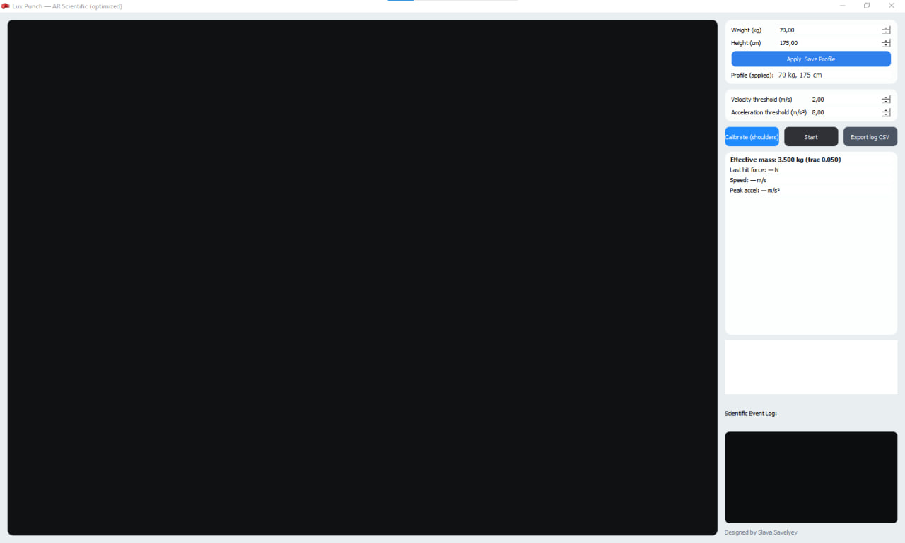

# Lux Punch 🥊✨  
**Real‑time AR punch analyzer** powered by **MediaPipe Pose** + **OpenCV**.

<p align="center">
  
</p>

<p align="center">
  <!-- Replace `slavasavelyev/lux_punch` after publishing -->
  <a href="https://github.com/slavasavelyev/lux_punch/actions/workflows/ci.yml">
    
  </a>
  
  
</p>

---

## What is it?

Lux Punch is a desktop application that uses a webcam + pose estimation to:

- track wrist motion in real time,
- detect punch‑like “hit events” (Left / Right),
- estimate **speed**, **peak acceleration**, and a simple **force proxy**:  
  \( F \approx m_{eff} \cdot a \)

> ⚠️ **Important**: this is a *vision‑based estimator*, not a calibrated force sensor.  
> The “force” number is best treated as a **relative metric** for training/gamification, not a lab‑grade measurement.

---

## Features

- **Desktop GUI (PyQt5)** with live video, event log, and a mini force graph.
- **Auto‑calibration** of pixel‑to‑meter scale using shoulder width heuristic (height‑based).
- **Manual “Calibrate (shoulders)”** button for better stability.
- Configurable **velocity** and **acceleration** thresholds.
- **CSV export** of detected events.
- A **minimal OpenCV demo** (`main.py`) for quick experiments.

---

## Quick start

### 1) Requirements

- **Python 3.9 – 3.12**  
  (MediaPipe’s PyPI classifiers list support for 3.9–3.12.)  
- Webcam

> If you hit installation issues with MediaPipe on your platform/Python version, try Python **3.11** first.

### 2) Install

```bash
# (Recommended) create a virtual environment
python -m venv .venv

# Windows:
.venv\Scripts\activate

# macOS/Linux:
source .venv/bin/activate

python -m pip install --upgrade pip
pip install -r requirements.txt
```

### 3) Run the GUI

```bash
python lux_punch_app.py
```

### 4) Run the minimal demo

```bash
python main.py --camera 0
```

---

## How to use (GUI)

1. Click **Start**.
2. Stand in front of the camera so your **shoulders and wrists** are visible.
3. (Recommended) Click **Calibrate (shoulders)** while standing in a neutral pose.
4. Throw punches. When a hit is detected, you’ll see:
   - **Last hit force (N)** — proxy metric
   - **Speed (m/s)**
   - **Peak accel (m/s²)**
   - event appears in the **Scientific Event Log**
5. Click **Export log CSV** to save a session log.

### Settings persistence

The app stores per‑user settings in `user_settings.json` (generated locally).  
A template is provided as `user_settings.example.json`.

---

## Under the hood (engineering overview)

### 1) Pose estimation
MediaPipe Pose returns normalized landmark coordinates \((x,y,z)\) for the body.

### 2) Pixel → meter calibration (scale)
To convert motion to physical units, Lux Punch estimates a **meters‑per‑pixel** scale from shoulder distance:

1. Measure **pixel shoulder width** between landmarks (left/right shoulder).
2. Estimate real shoulder width from user height:
   \[
   shoulder\_width \approx 0.22 \cdot height
   \]
3. Compute:
   \[
   meters\_per\_pixel = \frac{shoulder\_width\_m}{shoulder\_width\_px}
   \]

### 3) Kinematics
Wrist positions are buffered over time and velocity/acceleration are computed via finite differences.

### 4) Hit event detection
A “hit” is triggered if:
- \( \|v\| > v_{threshold} \) **and**
- \( \|a\| > a_{threshold} \)
with a short re‑arm cooldown to avoid double‑counting.

### 5) Force proxy
The app uses:
\[
F \approx m_{eff} \cdot a
\]
where \( m_{eff} = body\_mass \cdot eff\_frac \) and by default `eff_frac = 0.05`.

---

## Accuracy & limitations

This project is intentionally lightweight and real‑time, but it has known limitations:

- **No ground truth**: monocular vision cannot directly measure impact force.
- **Acceleration spikes** can be noisy due to pose jitter → thresholds matter.
- **Depth (z)** from MediaPipe is heuristic; most stability comes from 2D motion.
- Lighting, camera FOV, and distance to camera influence scale estimation.

If you want more scientific results, consider:
- fusing with **IMU / accelerometer** in gloves,
- adding temporal filtering (e.g., Savitzky–Golay),
- per‑user calibration with a reference object or measured shoulder width.

---

## Troubleshooting

### `AttributeError: module 'mediapipe' has no attribute 'solutions'`
A regression was reported for **mediapipe==0.10.31** on some environments.  
Try upgrading to a newer version or installing a known‑good version.

```bash
pip install --upgrade mediapipe
# or:
pip install "mediapipe==0.10.21"
```

### Camera does not open
- Close apps that may be using the webcam (Zoom/Teams/etc).
- Try changing the camera index in the demo:
  ```bash
  python main.py --camera 1
  ```

---

## Packaging (Windows / PyInstaller)

A Windows build script used during development is included here:

- `packaging/windows/build_luxpunch.bat`
- `packaging/windows/lux_punch_app.spec`

**Note:** you may need to adapt paths to your local virtual environment and MediaPipe package location.  
MediaPipe often requires explicitly bundling its `modules/` assets when freezing.

---

## Project layout

```
.
├─ lux_punch_app.py              # Main desktop GUI app
├─ main.py                       # Minimal OpenCV demo
├─ pose_utils.py                 # Kinematics buffer + helpers
├─ calibration.py                # Pixel-to-meter estimation
├─ lux_icon.ico                  # App icon
├─ user_settings.example.json    # Settings template (runtime file is ignored)
├─ tests/                        # Unit tests (math/kinematics)
├─ docs/assets/                  # README images
└─ packaging/windows/            # PyInstaller helpers
```

---

## Contributing

Pull requests are welcome. Please:

- keep changes small and focused,
- include tests for math/logic where possible,
- avoid breaking real‑time performance.

See: `CONTRIBUTING.md`.

---

## License

Lux Punch is released under **GPL‑3.0‑or‑later** (see `LICENSE`).  
This choice is intentional because **PyQt5 is distributed under GPL v3 (or a commercial license)**.

---

## Credits

**Developed & Designed by Slava Savelyev**.

Built with:
- MediaPipe (Apache 2.0)
- OpenCV
- NumPy
- PyQt5
- Matplotlib

---

